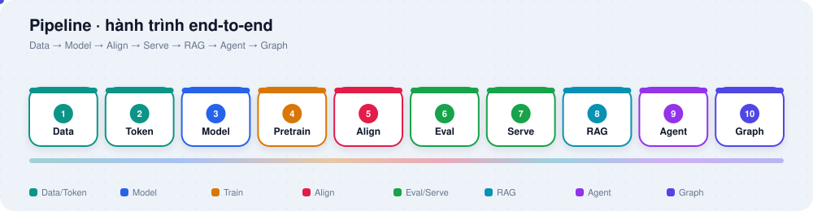
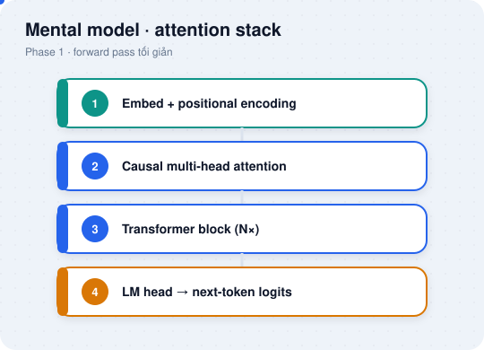
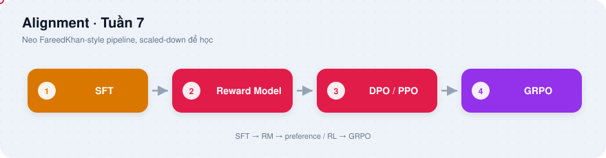
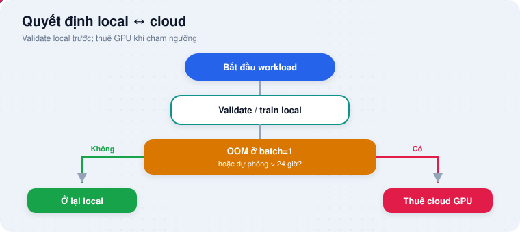

# LLM From Scratch - Lộ trình tự học 15 tuần

**From Transformer internals to an Agentic SDLC & Graph Engineering.**
---
Từ nội tại Transformer đến Agentic SDLC và Graph Engineering.

> **Tuyên bố / Disclaimer**
>
> Đây là **dự án học thuật, nghiên cứu cá nhân, không thương mại hóa**. Toàn bộ nội dung (lộ trình, ghi chú, code skeleton, quiz) chỉ phục vụ mục đích học tập và nghiên cứu; không phải sản phẩm, không phải tư vấn pháp lý hay tài chính.
>
> This is a **personal academic, research-only, non-commercial project**. All content (roadmap, notes, code skeletons, quizzes) exists solely for study and research; it is not a product and not legal or financial advice.
>
> Repo chỉ tham chiếu **nguồn mở**: repo GitHub công khai, paper truy cập mở (arXiv/ACL), tài liệu chính thức của công cụ, nguồn chính phủ, và dataset có license mở đã xác minh (CC BY / CC0 / MIT / Apache 2.0 / BSD). Các nguồn thương mại, sau paywall, license hạn chế (non-commercial, research-only, cấm train/distill/redistribute) đã được loại bỏ. Xem [CLAUDE.md](CLAUDE.md) cho quy tắc đầy đủ.

---

## Mục lục

1. [Đây là gì, dành cho ai](#1-đây-là-gì-dành-cho-ai)
2. [Tư duy lộ trình: Pipeline](#2-tư-duy-lộ-trình-pipeline)
3. [Ba phase và bản đồ tuần](#3-ba-phase-và-bản-đồ-tuần)
4. [Map pipeline với tuần](#4-map-pipeline-với-tuần)
5. [Từ GPT-2 đến trending 2026](#5-từ-gpt-2-đến-trending-2026)
6. [Cấu trúc repository](#6-cấu-trúc-repository)
7. [Cách dùng](#7-cách-dùng)
8. [Phần cứng và quyết định cloud](#8-phần-cứng-và-quyết-định-cloud)
9. [CornAgents.AI là gì](#9-cornagentsai-là-gì)
10. [Nguồn lõi (open-access)](#10-nguồn-lõi-open-access)

Chi tiết tuần-by-tuần (mục tiêu, nguồn, deliverable, giờ ước lượng): [Week-00/plan_llm_from_scratch_vi.md](Week-00/plan_llm_from_scratch_vi.md) · [EN](Week-00/plan_llm_from_scratch_en.md).

---

## 1. Đây là gì, dành cho ai

Repo này là lộ trình tự học có cấu trúc. Bạn đi từ gọi API LLM, sang tự build model (backprop, attention, GPT-2-class bằng pure PyTorch), rồi RAG và fine-tuning thực chiến, cuối cùng dựng framework cá nhân CornAgents.AI (agentic SDLC + knowledge graph), neo domain Finance Banking.

Lịch học: 15 tuần, khoảng 10-15 giờ/tuần (~3.5-4 tháng bán thời gian). Mỗi tuần có thư mục riêng: README, skeleton code, template ghi chú, quiz tự kiểm.

Phù hợp nếu bạn đã gọi được LLM API và muốn hiểu phần dưới trước khi build hệ thống quanh model. Phong cách gần các lộ trình from-scratch kiểu [FareedKhan-dev/train-llm-from-scratch](https://github.com/FareedKhan-dev/train-llm-from-scratch) (Data → Model → Align), nhưng repo này mở thêm Phase 2 (RAG/QLoRA) và Phase 3 (Agentic SDLC / Graph Engineering).

Trước Tuần 1: tự đánh giá nền tảng ở [Week-00/prerequisites_vi.md](Week-00/prerequisites_vi.md). Chỉ vá các lỗ hổng checklist chỉ ra.

---

## 2. Tư duy lộ trình: Pipeline

15 tuần là lịch theo thời gian. Pipeline là khung tư duy end-to-end: cùng một hành trình, nhìn từ góc "chữ ký dữ liệu → hệ thống quanh model". Hai khung chạy song song, không thay thế nhau.

Một dòng (mở rộng từ ý tham chiếu FareedKhan + Phase 2-3 của repo này):

`raw text → tokens → Transformer → next-token → base → SFT → RM → {PPO, DPO} → GRPO → eval/serve → RAG → Agent → Graph`

<p align="center">
  
</p>

<details>
<summary>Bảng màu stage (fallback)</summary>

| Màu | Stage |
|-----|--------|
| Teal | Data / Token |
| Blue | Model |
| Amber | Pretrain / SFT |
| Coral | Align |
| Green | Eval / Serve |
| Cyan | RAG |
| Purple | Agent |
| Indigo | Graph |

Chi tiết palette: [docs/diagrams/PALETTE.md](docs/diagrams/PALETTE.md).

</details>

---

## 3. Ba phase và bản đồ tuần

<p align="center">
  
</p>

| Phase | Tuần | Nội dung ngắn |
|-------|------|----------------|
| 1 · Deep Internals | 1-7 | Build và pretrain model cỡ GPT-2 from scratch |
| 2 · RAG & Fine-Tuning | 8-11 | QLoRA, local serve, RAG + đo bằng RAGAS |
| 3 · Agentic SDLC | 12-15 | CornAgents.AI: agents + knowledge graph |

### Phase 1 - Deep Internals (Tuần 1-7)

Build và pretrain model cỡ GPT-2 from scratch.

| Tuần | Chủ đề |
|------|--------|
| 1 | Toán nền + PyTorch prerequisites |
| 2 | Backprop from scratch (micrograd) + mental model transformer |
| 3 | Tokenization, embeddings, attention from scratch |
| 4 | Lắp ráp và chạy full GPT model |
| 5 | Pretraining: training loop + một lần chạy GPT-2 thật (cloud) |
| 6 | Instruction fine-tuning (classification + instruction-following + LoRA) |
| 7 | Nhập môn alignment: SFT → Reward Model → DPO/PPO → GRPO |

Sau phase này bạn tự viết được attention stack, lắp GPT generate được text, chạy pretrain (local validate + cloud thật), làm SFT/LoRA, và chạy được một stage alignment scaled-down.

Mental model Phase 1 - attention stack tối giản:

<p align="center">
  
</p>

| Bước | Thành phần |
|------|------------|
| 1 | Embed + positional encoding |
| 2 | Causal multi-head attention |
| 3 | Transformer block (N×) |
| 4 | LM head → next-token logits |

Alignment (neo FareedKhan + Tuần 7):

<p align="center">
  
</p>

`SFT → Reward Model → DPO / PPO → GRPO`

### Phase 2 - Applied: RAG & Fine-Tuning (Tuần 8-11)

Chuyển từ code from-scratch sang tooling production.

| Tuần | Chủ đề |
|------|--------|
| 8 | QLoRA thực chiến (Unsloth, 7B-8B trên ~8GB VRAM) |
| 9 | Mac/MLX fine-tuning + local inference (Ollama, LM Studio) |
| 10 | RAG pipeline end-to-end trên tài liệu domain của bạn |
| 11 | Advanced RAG: hybrid search, reranking, RAGAS, tracing |

Bạn fine-tune được 7B-8B bằng QLoRA, dựng stack inference local, rồi có RAG baseline và nâng cấp + đo bằng RAGAS.

### Phase 3 - Agentic SDLC: CornAgents.AI (Tuần 12-15)

Xây multi-agent software-delivery assistant, neo domain của bạn.

| Tuần | Chủ đề |
|------|--------|
| 12 | Nền tảng agentic: 5 tầng engineering, Claude Agent SDK, MCP, loop đo được |
| 13 | Map LLM → các giai đoạn SDLC; multi-agent graph (5 workflow patterns) |
| 14 | Graph Engineering: knowledge graph làm shared memory / grounding / world model |
| 15 | Capstone: một workflow end-to-end + evaluation & observability |

Bạn nắm 5 tầng Prompt→…→Graph, dựng agent graph SDLC, chạy KG pipeline, và ship một workflow có eval.

---

## 4. Map pipeline với tuần

| Stage pipeline | Tuần neo chính |
|----------------|----------------|
| Data / Token / Model | W1-W4 |
| Pretrain | W5 |
| Align (SFT → RM → DPO/PPO → GRPO) | W6-W7 |
| Eval / Serve | W5, W8-W9 (+ eval xuyên suốt) |
| RAG | W10-W11 |
| Agent | W12-W13 |
| Graph | W14-W15 |

<p align="center">
  
</p>

---

## 5. Từ GPT-2 đến trending 2026

Lộ trình Phase 1 dựng model cỡ GPT-2 (kiến trúc ~2019). Model hiện đại đổi nhiều chi tiết (RoPE, GQA/MLA, MoE, …). Repo không nhồi chúng vào tuần nền; chúng nằm trong appendix [Week-00/advanced_topics_vi.md](Week-00/advanced_topics_vi.md), neo hai chiều với từng tuần.

Cách dùng: đừng đọc appendix một mạch. Mở đúng mục theo bảng dưới (tóm tắt từ bảng điều hướng chính thức trong file đó). Tuần 1-2 cố ý không có mục nâng cao.

| Cụm chủ đề (từ appendix) | Ví dụ mục | Đọc khi nào (tuần) |
|-------------------------|-----------|---------------------|
| Kiến trúc hiện đại | RoPE, RMSNorm, SwiGLU, GQA/MLA, MoE | W3 (A1-A6, C1-C2, E); W4 (A7, B1-B2) |
| Inference | KV cache, sampling, GGUF/quant | W4 (B1-B2); W8 (B4, H); W9 (B1, B3, B4/GGUF); W10 (B2) |
| Training / scale / eval | dynamics, DDP, bpb/CORE | W5 (D, D1-D2, F, H) |
| Alignment & reasoning | pipeline SFT→…; DPO, GRPO | W6 (G sơ đồ); W7 (G đầy đủ) |
| Agentic & graph | 5 layers, loop, KG | W12-W15 (I1-I5); W11/W15 eval (H) |

Chi tiết từng mục A-I và "vì sao đọc lúc này": mở trực tiếp [advanced_topics_vi.md](Week-00/advanced_topics_vi.md).

---

## 6. Cấu trúc repository

```
Week-00/          Lộ trình đầy đủ (VI + EN), prerequisites, advanced topics,
                  và guide dataset Finance Banking (chỉ license mở đã xác minh)
Week-01..15/      Mỗi tuần: README, skeleton code, template ghi chú, quiz
docs/             Tài liệu Phase 3:
                    - Graph-Engineering-Athropic-Playbook.pdf
                    - Graph-Engineering-Athropic-Karpathy-Loop.pdf
                    - 5-layers-multi-agent.jpg
                  diagrams/ - infographic SVG cho README (palette + SMIL nhẹ)
                  papers/ - kệ paper map theo tuần (PDF CC-BY/CC0 local + link-only;
                    xem papers/README.md; licenses đã kiểm 2026-08-12)
report/           Portal web: roadmap, checklist theo tuần, quiz flip-card
                  (mở report/index.html; tiến độ lưu local trong trình duyệt)
scripts/          quiz_bank.json (nguồn sự thật, 93 câu)
                  generate_quiz.py (sinh lại quiz Week-XX + data portal)
```

---

## 7. Cách dùng

1. Nền tảng: [Week-00/prerequisites_vi.md](Week-00/prerequisites_vi.md) - vá gap, không học tuần tự toàn bộ.
2. Đọc plan: [Week-00/plan_llm_from_scratch_vi.md](Week-00/plan_llm_from_scratch_vi.md) (hoặc [EN](Week-00/plan_llm_from_scratch_en.md)) - mục tiêu / nguồn / deliverable từng tuần.
3. Một tuần một folder: implement skeleton trước, rồi đối chiếu nguồn canonical.
4. Tự kiểm: làm `Week-XX/quiz.md` trước khi mở `quiz_solution.md`. Quiz sinh từ `scripts/quiz_bank.json`:
   ```bash
   python scripts/generate_quiz.py            # regenerate everything
   python scripts/generate_quiz.py --week 3   # one week only
   ```
5. Nâng cao đúng lúc: [Week-00/advanced_topics_vi.md](Week-00/advanced_topics_vi.md) - bảng neo tuần → mục; mỗi `Week-XX/README.md` có block "Bổ sung nâng cao" trỏ ngược lại.
6. Dataset domain: [Week-00/datasets_finance_banking.md](Week-00/datasets_finance_banking.md) - chỉ license mở đã xác minh tại ngày tra cứu. Điểm kiến trúc chính: kiến thức quy định thuộc RAG và knowledge graph, không nhồi vào trọng số fine-tune. Fine-tune cho hành vi, format, thuật ngữ song ngữ. Kiểm lại license lúc dùng.
7. Theo dõi tiến độ: mở [`report/index.html`](report/index.html).
8. Claude như co-learner: tự implement trước rồi nhờ review; dán loss curve / stack trace để debug; rubber-duck kiến trúc Phase 3.

---

## 8. Phần cứng và quyết định cloud

| Máy | Vai trò |
|-----|---------|
| RTX 3070 Ti (8GB) | Code from-scratch, train nhỏ, QLoRA 7B-8B |
| MacBook Pro 24GB (MLX) | Local inference model quantized 7B-14B; LoRA nhỏ |
| Cloud (RunPod / Lambda / Colab) | Pretrain GPT-2 một lần (~$15-35 theo ngữ cảnh plan) và fine-tune nặng hơn |

Quy tắc ngón tay: khi chạy local dự phóng vượt ~24 giờ, hoặc OOM ở batch size 1, thì chuyển sang GPU thuê.

<p align="center">
  
</p>

Chi tiết ước lượng giờ / VRAM từng tuần: xem plan VI.

---

## 9. CornAgents.AI là gì

CornAgents.AI là khái niệm của bạn, không phải sản phẩm: tên framework agentic-SDLC cá nhân bạn dựng ở Phase 3 trên Claude Agent SDK + MCP + LangGraph/CrewAI, kèm lớp knowledge graph (Tuần 14) cho shared memory và kiểm chứng neo. Artifact ứng dụng (RAG corpus, dataset fine-tune, capstone) neo domain Finance Banking, giữ generic. Chọn vùng nghiệp vụ bạn biết rõ nhất.

Tiến trình kỹ thuật năm tầng:

<p align="center">
  
</p>

1. Prompt engineering  
2. Context engineering  
3. Harness engineering  
4. Loop engineering  
5. Graph engineering  

Sơ đồ gốc: [`docs/5-layers-multi-agent.jpg`](docs/5-layers-multi-agent.jpg). Playbook Graph Engineering trong [`docs/`](docs/).

---

## 10. Nguồn lõi (open-access)

- Repo from-scratch mã nguồn mở: `karpathy/micrograd`, `karpathy/makemore`, `karpathy/nanoGPT`, `karpathy/nanochat`, `karpathy/llm.c`; `FareedKhan-dev/train-llm-from-scratch` (full alignment suite pure PyTorch). Kiểm file LICENSE của từng repo trước khi tái sử dụng code.
- Paper truy cập mở: *Attention Is All You Need*, GPT-2, LoRA, QLoRA, DPO, InstructGPT và preprint liên quan trên arXiv / ACL Anthology; *The Annotated Transformer* (Harvard NLP).
- Tài liệu chính thức công cụ: PyTorch, Hugging Face (PEFT/TRL, Ultra-Scale Playbook), LangChain, LlamaIndex, MLX, Ollama, NetworkX.
- Anthropic (tài liệu/cookbook mở): Building Effective AI Agents, Claude Agent SDK, MCP, Knowledge Graph Construction Cookbook (claude-cookbooks).
- Ghi chú Graph-Engineering (tổng hợp độc lập - xem cover page của từng PDF) và sơ đồ 5 tầng trong [docs/](docs/).

Quy tắc nguồn đầy đủ: [CLAUDE.md](CLAUDE.md).

---

> *"The model is becoming a commodity. The system around it is where the real engineering lives now."*
