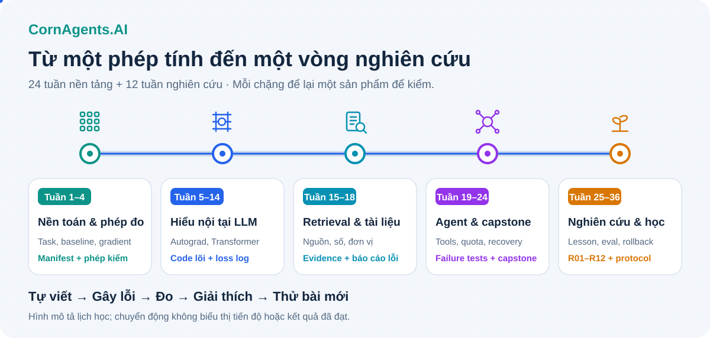
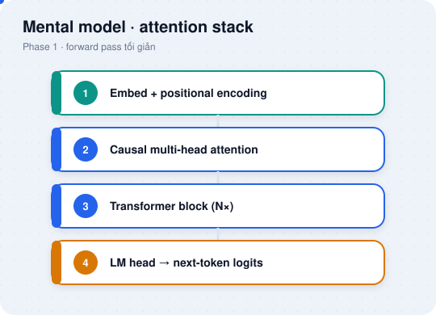
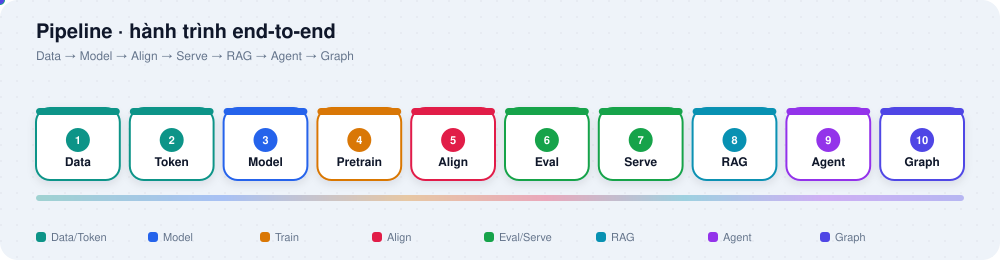
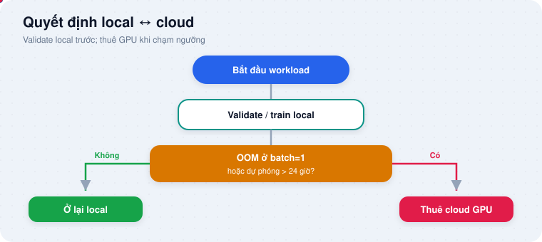
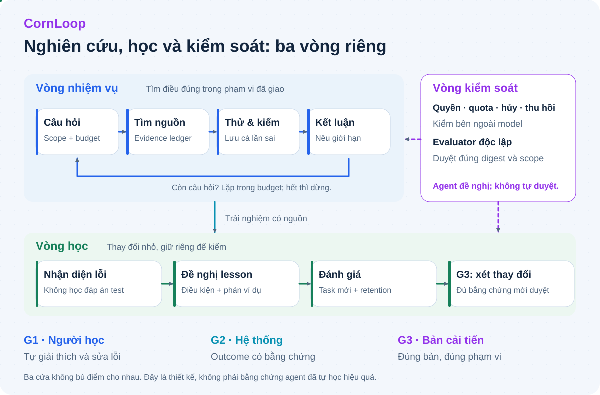
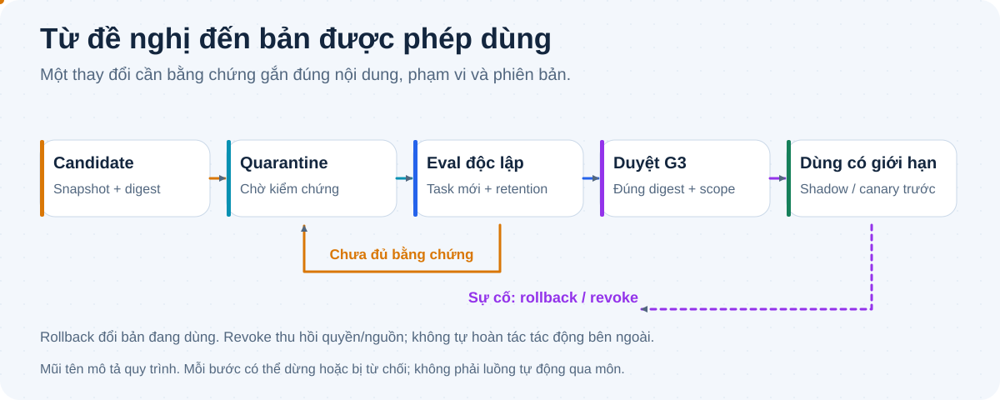

# LLM From Scratch — CornAgents.AI

**Tự viết một mô hình nhỏ, hiểu vì sao nó chạy, rồi xây một trợ lý biết tìm nguồn, kiểm kết quả và học từ lỗi.**

Bạn sẽ đi từ một phép nhân ma trận đến Transformer, từ một câu trả lời có nguồn đến một vòng nghiên cứu có thể chạy lại. Mỗi chặng để lại một sản phẩm: code do bạn hiểu, phép kiểm có chủ đích và báo cáo viết từ kết quả thật.

<picture>
  <source media="(max-width: 600px)" srcset="docs/diagrams/08-learning-journey-mobile.svg">
  
</picture>

*Chuyển động minh họa hướng học, không phải tiến độ đã hoàn thành. [Xem bộ hình và bật/tắt motion](docs/diagrams/index.html) · [Bản đứng yên](docs/diagrams/08-learning-journey-static.svg).*

> Dự án học thuật, nghiên cứu cá nhân. Dùng dữ liệu công khai hoặc giả lập theo [quy tắc repo](CLAUDE.md). Lịch chính gồm **36 tuần**. Các hình của lịch **18 tuần** nằm trong mục Fast-track để đối chiếu.

**Bắt đầu:** [Chọn bài học](ENTRYPOINTS.md) · [Roadmap chi tiết](Week-00/plan_llm_from_scratch_vi.md) · [Portal học tập](report/index.html) · [Kiểm tra nền tảng](Week-00/prerequisites_vi.md)

## Mục lục

1. [Đây là gì, dành cho ai](#1-đây-là-gì-dành-cho-ai)
2. [Tư duy lộ trình: Pipeline](#2-tư-duy-lộ-trình-pipeline)
3. [Các phase và bản đồ tuần](#3-các-phase-và-bản-đồ-tuần)
4. [Map pipeline với tuần](#4-map-pipeline-với-tuần)
5. [Chủ đề nâng cao và cách chọn](#5-chủ-đề-nâng-cao-và-cách-chọn)
6. [Cấu trúc repository](#6-cấu-trúc-repository)
7. [Cách dùng](#7-cách-dùng)
8. [Phần cứng và quyết định cloud](#8-phần-cứng-và-quyết-định-cloud)
9. [CornAgents.AI là gì](#9-cornagentsai-là-gì)
10. [Nguồn lõi và phạm vi đối chiếu](#10-nguồn-lõi-và-phạm-vi-đối-chiếu)
11. [Kệ sách nền tảng](#11-kệ-sách-nền-tảng)

## 1. Đây là gì, dành cho ai

Lộ trình dành cho người đã biết lập trình và muốn hiểu LLM từ cơ chế đến cách dùng trong một hệ thống có bằng chứng. Bạn không cần bắt đầu bằng một model lớn: một ví dụ nhỏ đủ để nhìn thấy gradient sai, attention nhìn trộm tương lai hoặc parser đọc nhầm đơn vị.

| Bạn đang ở đâu? | Điểm vào phù hợp |
|---|---|
| Chưa vững Python, Git, terminal | Đọc [prerequisites](Week-00/prerequisites_vi.md), thực hành nền trước khi vào tuần 1 |
| Biết lập trình, mới học AI | Lịch chính: **24 tuần nền + 12 tuần nghiên cứu** |
| Đã có nền ML và systems | Dùng **fast-track 18 tuần**, đối chiếu năng lực còn thiếu trước phần nghiên cứu |

Nhịp 10–12 giờ/tuần là **giả định thiết kế**, không phải thời lượng đã đo. Bạn có thể chia một tuần thành nhiều buổi; đi tiếp khi giải thích và kiểm được bài, thay vì chạy theo ngày trên lịch.

## 2. Tư duy lộ trình: Pipeline

Bạn sẽ lần lượt trả lời: **Dữ liệu có gì? Model tính gì? Học được gì? Câu trả lời dựa vào đâu? Agent được phép làm gì? Một thay đổi có thật sự tốt hơn không?**

`Dữ liệu → Toán → Autograd → Tokenizer/Transformer → Training → SFT/LoRA → Retrieval → Agent → Nghiên cứu → Kiểm bản cải tiến`

Phép đo đi cùng mọi bước. Loss giảm chưa đủ chứng minh trả lời đúng; nhiều agent đồng ý chưa đủ chứng minh một phát biểu là thật. Mỗi kết luận cần nguồn hoặc phép kiểm phù hợp.



Sau phần nền, bạn tự giải thích được đường đi từ token đến logits, viết và gây lỗi một attention block, rồi dùng test để tìm lại lỗi đó.

## 3. Các phase và bản đồ tuần

| Chặng | Tuần chính | Bạn làm được gì khi hoàn thành bài? | Sản phẩm để tự kiểm |
|---|---|---|---|
| **0 · Nền toán và phép đo** | 1–4 | Xác định task, lập baseline, hiểu ma trận và gradient | Manifest, regression NumPy, gradient check |
| **1 · Hiểu nội tại LLM** | 5–14 | Tự viết autograd, attention, tiny Transformer; hiểu training và alignment | Code lõi, causal/cache tests, data card, báo cáo model nhỏ |
| **2 · Retrieval và tài liệu** | 15–18 | Tìm đoạn nguồn, kiểm số/đơn vị, đo serving | So sánh retrieval, evidence spans, báo cáo lỗi và tài nguyên |
| **3 · Agent và capstone nền** | 19–24 | Giới hạn tools/quyền/budget; kiểm retry, recovery và evaluator | Failure tests, capstone có đối chứng, bảo vệ bài không dùng AI |
| **4 · Nghiên cứu và học có kiểm soát** | 25–36 | Đề nghị lesson/candidate, đánh giá chuyển giao và thu hồi khi cần | R01–R12, protocol nghiên cứu, evidence package và rollback drill |

Mở [mục lục 36 tuần](ENTRYPOINTS.md) để vào từng bài. Mỗi tuần có mục tiêu, lý thuyết, starter, protocol, báo cáo và quiz.

<details>
<summary><b>Fast-track 18 tuần: hình lộ trình và map tuần</b></summary>







Hình giữ nguyên lịch rút gọn của repo: toán → deep internals → ứng dụng → agent/graph. Lịch chính dành thêm thời gian cho baseline, evidence, Document AI và nghiên cứu. Hai lịch có số tuần khác nhau; dùng [bảng quy đổi](Week-00/plan_llm_from_scratch_vi.md#fast-track-18-tuần-giữ-thư-mục-bổ-sung-theo-năng-lực) để đối chiếu.

</details>

## 4. Map pipeline với tuần

| Nội dung | Lịch chính | Tài liệu fast-track tái sử dụng |
|---|---|---|
| Task, môi trường, baseline | 1–2 | Prerequisites; bài mới trong lịch chính |
| Toán, autograd, MLP | 3–6 | Week-01–05 |
| Tokenizer, attention, Transformer | 7–10 | Week-06–07 |
| Dữ liệu và training | 11–12 | Week-08 |
| SFT/LoRA và preference learning | 13–14 | Week-09–12 |
| Retrieval, Document AI, serving | 15–18 | Week-12–14 và bài mới |
| Bounded agent, durable workflow | 19–22 | Week-15–16 và failure tests |
| Capstone nền | 23–24 | Week-18; graph Week-17 tùy bài toán |
| Nghiên cứu và learning | 25–36 | [12 lab](labs/README.md) và [tri thức theo chủ đề](modules/README.md) |

## 5. Chủ đề nâng cao và cách chọn

RoPE, GQA, KV cache, quantization, graph, multi-agent hay tối ưu prompt đều có chỗ dùng. Học khi bài toán cho thấy bạn cần hiểu thêm, và so với một bản đối chứng đơn giản trước khi thêm lớp mới. [Advanced topics](Week-00/advanced_topics_vi.md) giữ phần đọc sâu theo lịch fast-track.

Alignment có các nhánh khác nhau: DPO học trực tiếp từ preference pairs, không cần reward model riêng; RM → PPO là nhánh RLHF. GRPO là thuật toán, RLVR mô tả reward kiểm chứng được. Đọc [ghi chú alignment](Week-10/01_theory_notes.md) và [nguồn DPO](docs/papers/research_learning_sources.md) để phân biệt.

## 6. Cấu trúc repository

```text
Week-00/               Roadmap, prerequisites, chủ đề nâng cao
Week-01/ … Week-18/    Các bài fast-track gốc
tracks/core-24/        Tuần 1–18 của lịch chính
Week-19/ … Week-36/    Tuần 19–36 của lịch chính
ENTRYPOINTS.md         Mục lục vào đúng bài của từng lịch
curriculum.json        Metadata 36 tuần
docs/curriculum/       Phân bổ chương trình và hướng dẫn triển khai
docs/books/, papers/   Catalog sách, paper và nguồn tham khảo
docs/diagrams/         Diagram lịch chính, motion và hình fast-track gốc
modules/               Tri thức nghiên cứu, memory, eval và runtime
labs/                  12 lab: starter, reference, fixtures, tests
research/              Giả thuyết và protocol nghiên cứu
evaluation/            Protocol, mẫu hồ sơ và kết quả kiểm offline
benchmarks/            Thiết kế benchmark và fixture development
report/                Portal bài học, quiz và tiến độ
```

Các thư mục lịch chính và fast-track được giữ riêng để tránh mở nhầm bài cùng số tuần. [ENTRYPOINTS](ENTRYPOINTS.md) là cửa vào thống nhất.

## 7. Cách dùng

1. Đọc mục tiêu tuần, dự đoán kết quả và viết protocol trước khi chạy.
2. Tự làm starter hoặc code lõi. Nhờ AI gợi ý phản ví dụ, giải thích lỗi và review sau khi bạn đã thử.
3. Chủ động gây lỗi: bỏ causal mask, đổi đơn vị, dùng nguồn hết hiệu lực hoặc retry sau khi mất ack.
4. Đo bằng phép kiểm phù hợp; lưu cả lượt thất bại và kết quả không cải thiện.
5. Làm quiz, viết báo cáo bằng output thật, rồi tự bảo vệ bài bằng một biến thể mới.

**Ba cửa cần phân biệt:** G1 kiểm bạn có hiểu và tự làm được; G2 kiểm outcome của hệ thống; G3 kiểm đúng bản cải tiến trước khi dùng. Tick checklist trong [portal](report/index.html) chỉ giúp ghi tiến độ.

Để kiểm các ví dụ tham chiếu offline:

```bash
python3 scripts/run_learning_checks.py
```

[Báo cáo hiện có](evaluation/offline_check_report.json) ghi **23 test đạt, 44 tình huống fixture công khai**. Kết quả này kiểm các ví dụ hữu hạn; chưa đo chất lượng model thật, kết quả học của bạn hoặc năng lực agent trong production. Mẫu báo cáo của bài học giữ trống tới khi bạn chạy.

## 8. Phần cứng và quyết định cloud

Bắt đầu bằng CPU, model nhỏ và workload dễ đo. RTX 3070 Ti hoặc Mac có thể là môi trường thực hành tùy bài; quyết định thuê cloud sau khi có smoke test, peak memory, throughput và budget thực tế.

<details>
<summary><b>Tham khảo luồng cân nhắc local và cloud</b></summary>



Mốc 24 giờ trong hình là quy tắc cân nhắc của lịch cũ, không phải giới hạn kỹ thuật hoặc thời gian train đã đo. Bạn chọn ngưỡng theo ngân sách và thời gian của mình. Dung lượng weights không đại diện toàn bộ RAM/VRAM: còn activations, optimizer, gradients, cache và runtime overhead. Repo không cam kết model lớn vừa máy hoặc giá cloud cố định.

</details>

## 9. CornAgents.AI là gì

CornAgents.AI là hướng xây trợ lý nghiên cứu kỹ thuật từ những cơ chế bạn đã học: hiểu câu hỏi, tìm nguồn, lập giả thuyết, chạy thí nghiệm trong phạm vi và đề nghị cải tiến có thể kiểm tra.





[CornLoop](modules/research-contracts.md) nối ba vòng: nghiên cứu một nhiệm vụ, học từ trải nghiệm, và kiểm soát thay đổi. Agent được đề nghị lesson hoặc candidate; quyền thực thi, evaluator và quyết định phát hành cần được kiểm bên ngoài model.



Bài nghiên cứu đầu tiên là [H1: lesson có điều kiện và phản ví dụ](research/hypotheses/H1.md), so với bộ nhớ trải nghiệm và bản tóm tắt cùng độ dài. Đây là giả thuyết để thử, chưa có kết quả chứng minh thắng. [CornBench-VI](benchmarks/cornbench_vi_rl/DESIGN.md) hiện là thiết kế benchmark; fixture nhỏ phục vụ phát triển, chưa đại diện tập đánh giá thực.

## 10. Nguồn lõi và phạm vi đối chiếu

Phần nền học cùng [micrograd](https://github.com/karpathy/micrograd), [makemore](https://github.com/karpathy/makemore), [nanoGPT](https://github.com/karpathy/nanoGPT), sách và paper được dẫn trong từng bài. Đọc code để hiểu, tự viết bản nhỏ để kiểm lại.

Phần nghiên cứu đã được phân bố vào [tài liệu chương trình](docs/curriculum/README.md), [modules](modules/README.md), [đặc tả lab](labs/specifications.md), [protocol đánh giá](evaluation/protocols/confirmation.md) và [thiết kế benchmark](benchmarks/cornbench_vi_rl/DESIGN.md). [Catalog nguồn nghiên cứu](docs/papers/research_learning_sources.md) giữ URL sơ cấp và giới hạn sử dụng của từng nguồn.

Nguồn tham khảo không tự xác nhận toàn bộ thiết kế CornAgents.AI. Catalog kế thừa chưa được kiểm lại toàn văn trong lần biên tập này; kiểm phiên bản và điều khoản khi dùng. Không lấy số của paper, ví dụ hoặc mô phỏng điền vào báo cáo chất lượng của dự án.

## 11. Kệ sách nền tảng

[Chọn sách và chương cần đọc](docs/books/README.md), rồi mở bài theo [roadmap](Week-00/plan_llm_from_scratch_vi.md). Không cần đọc hết một cuốn trước khi viết code: đọc đúng phần để giải thích công thức, kiểm lại bằng ví dụ và quay lại khi gặp câu hỏi mới.

Số tuần trong catalog sách hiện theo fast-track. Đối chiếu bảng quy đổi khi học lịch chính; quyền đọc công khai không tự đồng nghĩa quyền tái phân phối hoặc đưa vào dữ liệu train.
